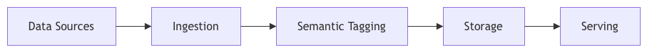
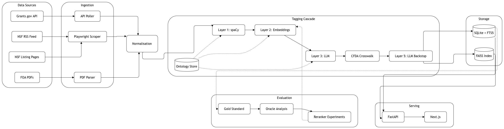
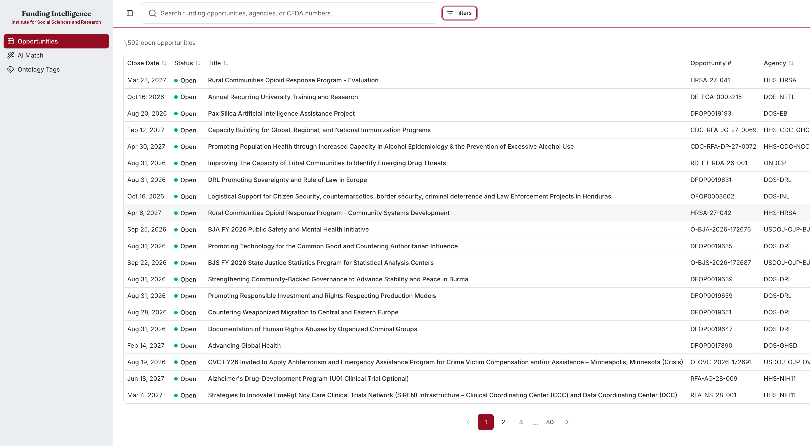
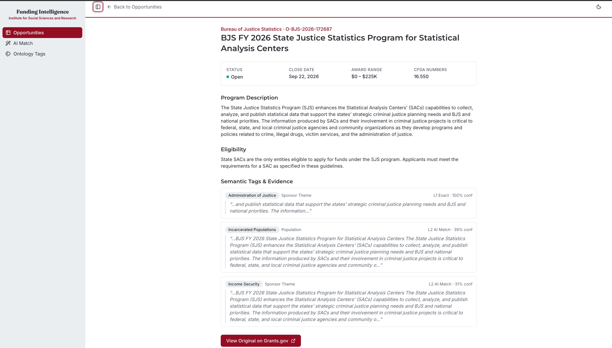
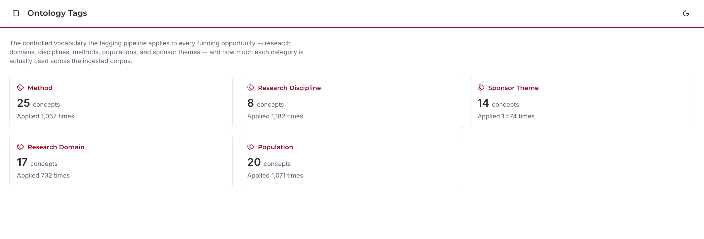
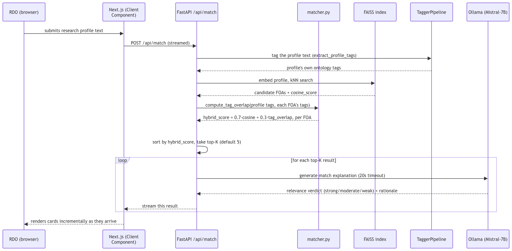
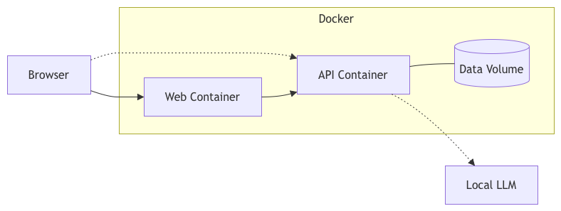

# ISSR AI-Powered Funding Intelligence


> An end-to-end system that automatically discovers, parses, normalises, and semantically tags federal Funding Opportunity Announcements (FOAs) — built as a **Google Summer of Code 2026** project for the [HumanAI Foundation](https://humanai.foundation/) / [University of Alabama ISSR](https://issr.ua.edu/).

**Contributor:** Pratik Pawar
**Mentor:** Andrya Allen

---

## Architecture

At a glance, the system moves data through five stages:



The full picture, including all five tagging layers, the ontology store, and
the offline evaluation loop that feeds back into tuning Layer 2:



---

## Features

| Feature | Description | Status |
|---|---|---|
| **Grants.gov Ingestion** | Polls the Grants.gov REST API with pagination, retry backoff, and deduplication | Complete |
| **NSF Web Scraping** | RSS feed detection → headless Playwright scraping of JS-rendered NSF pages | Complete |
| **Layout-Aware PDF Parsing** | pymupdf4llm preserves column reading order; pdfplumber extracts tables | Complete |
| **Data Normalisation** | Harmonises dates, amounts, text encoding across all sources into a canonical schema | Complete |
| **JSON Schema Validation** | Draft-7 validation enforcing required fields, date formats, and enum values | Complete |
| **Ontology Store** | SQLite-backed taxonomy with GREAT Act categories, UN SDGs, research methods, populations | Complete |
| **Synonym Expansion** | WordNet-based expansion for improved recall in terminological matching | Complete |
| **Layer 1 Tagging (spaCy)** | spaCy PhraseMatcher for exact/synonym terminological matching | Complete |
| **Layer 2 Tagging (Embeddings)** | all-mpnet-base-v2 cosine similarity for semantic gap-filling | Complete |
| **Layer 3 Tagging (LLM)** | Mistral-7B via Ollama for ambiguous/cross-domain disambiguation | Complete (was a stretch goal) |
| **Evaluation Framework** | Gold standard P/R/F1 evaluation with per-category error analysis | Complete |
| **PDF Downloader** | Async aiohttp downloader for linked PDFs with auto-parsing | Complete |
| **Vector Search** | FAISS IndexFlatIP for semantic similarity search across FOA embeddings | Complete (was a stretch goal) |
| **Grant Matching** | Researcher profile → ranked FOAs via hybrid cosine + tag-overlap score, with LLM-generated match explanations for the top results | Complete |
| **FastAPI Backend** | REST API with CRUD, search, match, tag, and export endpoints | Complete |
| **Web Frontend** | Next.js — dense results table + faceted sidebar filters matching simpler.grants.gov's layout, ISSR-themed; FOA detail view, AI Match, and Ontology Tags dashboard | Complete |
| **CSV/JSON Export** | Structured export with tag evidence provenance | Complete |
| **Docker Deployment** | Full-stack containerisation with docker-compose | Complete |

---

## Screenshots

**Opportunities** — dense, sortable table with faceted filters, matching simpler.grants.gov's layout:



**FOA Detail** — every field plus the semantic tags applied to it, each with its source layer, confidence, and the exact evidence snippet:



**AI Match** — a researcher profile ranked against the corpus by hybrid relevance score, with an LLM-generated explanation per result:


**Ontology Tags** — how much of the controlled vocabulary is actually in use across the ingested corpus:



---

## GSoC Timeline & Progress

| Phase | Timeline | Deliverable | Status |
|---|---|---|---|
| **Phase 0** | Community Bonding | Ontology setup, directory structure, dev environment | Done |
| **Phase 1** | Weeks 1–3 | Hybrid ingestion engine + PDF parser + normalisation | Done |
| **Phase 2** | Weeks 4–6 | Schema enforcement + Layer 1 spaCy tagger + evaluation | Done |
| **Phase 3** | Weeks 7–8 | Embedding layer (L2) + merge integration | Done |
| **Phase 4** | Week 9 | Evaluation metrics (P/R/F1) + matching foundation | Done |
| **Phase 5** | Weeks 10–12 | Integration testing + Docker + API + frontend | Active |
| **Phase 6** | Week 13 | Final report + documentation + handoff | Upcoming |

---

## Quickstart

### Prerequisites

- Python 3.9+
- [Playwright browsers](https://playwright.dev/python/docs/intro) (for NSF scraping)
- [Ollama](https://ollama.com) with `mistral:7b-instruct` — **optional**; Layer 3 disambiguation degrades gracefully to Layer 1 + Layer 2 without it

### Installation

```bash
# Clone the repository
git clone https://github.com/PratikPawar1401/funding-intelligence.git
cd funding-intelligence

# Create virtual environment
python -m venv .venv
source .venv/bin/activate

# Install dependencies
pip install -r requirements.txt

# Install NLP models
python -m spacy download en_core_web_lg
python -m nltk.downloader wordnet omw-1.4

# Install Playwright browsers (for NSF scraping)
playwright install chromium

# Configure environment
cp .env.example .env
# Edit .env as needed
```

### Run the Pipeline

```bash
# Full ingestion → normalisation → tagging pipeline
make pipeline

# Or run individual steps:
make ingest-grants       # Poll Grants.gov API
make ingest-nsf-rss      # Poll NSF RSS feed
make ingest-nsf-scrape   # Scrape pending NSF URLs via Playwright
make normalise           # Normalise + validate + load into SQLite
make enrich-foas         # Download and parse FOA PDFs
make setup-ontology      # Load ontology concepts into store
make tag                 # Run semantic tagging (L1 + L2 + L3) and build the FAISS index
make export-csv          # Export tagged records to CSV
make export-json         # Export tagged records to JSON
```

Both exports land in `data/normalised/` and carry the same records in different
shapes. **CSV** is flattened for humans — tags collapsed into one column, the
description truncated — because research development officers open it in Excel.
**JSON** keeps the full structure: untruncated descriptions and tags as objects
with their category, confidence, source layer and evidence snippet. Re-exporting
unchanged data produces a byte-identical file, so a diff means the data moved.

### Match a Researcher Profile to Funding Opportunities

Ranks FOAs for a researcher using the hybrid relevance score
(`0.7 × cosine similarity + 0.3 × ontology tag overlap` — see [MATCHING.md](Documentation/MATCHING.md)).
Requires the FAISS index, so run `make tag` first.

```bash
PYTHONPATH=src python -m foa_pipeline.cli search \
    --profile "computational social science, housing policy, rural health disparities" \
    --k 10
```

Each result shows its cosine score, tag-overlap ratio, and the specific matched
tags, so a ranking can be explained rather than taken on trust.

The same flow, as served through the web frontend's streamed `/api/match` endpoint:



### Evaluate Tagging Accuracy

```bash
# Against the 20-FOA hand-labelled gold set (the reported metric)
PYTHONPATH=src python -m foa_pipeline.cli evaluate --gold

# Against the larger LLM-generated silver set (threshold tuning only)
PYTHONPATH=src python -m foa_pipeline.cli evaluate

# How well Layer 2 separates correct from incorrect tags (run an evaluation first)
PYTHONPATH=src python -m foa_pipeline.cli diagnose-separation
```

### Benchmark Discipline Tagging at Scale

The hand-labelled gold set carries only ~3 examples per NSF directorate, too few
to say anything reliable per concept. NSF's Award Search API supplies thousands
of abstracts whose directorate NSF assigned itself, giving a discipline benchmark
at zero annotation cost:

```bash
make harvest-nsf-awards      # ~1,250 awards -> data/evaluation/nsf_awards.jsonl
make benchmark-disciplines   # top-1/top-3 accuracy, MRR, confusion matrix
```

Awards are written to the evaluation directory only. They are deliberately kept
out of the FOA database: an award describes work that was funded, an FOA solicits
it, and mixing the two genres would change what the corpus and search index mean.
Treat the resulting numbers as a complementary benchmark, not a gold-set result —
see [EVALUATION.md](Documentation/EVALUATION.md) §4e.

### Run the API Server

```bash
make serve
# API available at http://localhost:8000
# Docs at http://localhost:8000/api/docs
```

### Run the Web Frontend

The frontend (`web/`) is a Next.js app and runs as its own server, separate
from the API. It needs the API running (`make serve`, above) to have data to
show.

```bash
make web-install   # first time only
make web-dev
# Frontend available at http://localhost:3000
```

`web/.env.example` documents the two API base-URL variables it reads
(`API_BASE_URL` for server-side fetches, `NEXT_PUBLIC_API_BASE_URL` for the
browser) — copy it to `.env.local` if the API isn't at the default
`http://localhost:8000`.

### Run Tests

```bash
pip install -r requirements-dev.txt
make test

# With coverage report
PYTHONPATH=src pytest --cov=src/foa_pipeline tests/
```

### Docker

```bash
make docker-up     # Build and start all services
make docker-down   # Stop services
```

The API and web frontend run as separate containers, with the web container
reaching the API server-to-server and the browser talking to it directly only
for the AI Match view (the two-CORS-path split documented in `config.py`):



---

## Project Structure

```
funding-intelligence/
├── src/foa_pipeline/
│   ├── cli.py                    # CLI entry point (17 subcommands)
│   ├── config.py                 # Environment-based configuration
│   ├── logging_setup.py
│   │
│   ├── ingestion/                # Source connectors
│   │   ├── grants_gov.py         #   Grants.gov REST API client
│   │   ├── nsf_rss.py            #   NSF RSS feed change detector
│   │   ├── nsf_scraper.py        #   Playwright headless scraper
│   │   └── pdf_downloader.py     #   Async PDF retrieval
│   │
│   ├── parsing/                  # Document extraction
│   │   ├── pdf_parser.py         #   Layout-aware PDF extraction
│   │   └── budget_extractor.py   #   LLM budget-tier extraction
│   │
│   ├── normalisation/            # Canonical schema
│   │   ├── normaliser.py         #   Multi-source normalisation
│   │   ├── validator.py          #   JSON Schema validation
│   │   └── schema.py             #   Record builder
│   │
│   ├── ontology/                 # Controlled vocabulary
│   │   ├── store.py              #   SQLite taxonomy management
│   │   └── synonyms.py           #   WordNet synonym expansion
│   │
│   ├── tagging/                  # Semantic tagging engine
│   │   ├── pipeline.py           #   L1 → L2 → L3 orchestrator
│   │   ├── layer1_spacy.py       #   Layer 1: spaCy PhraseMatcher
│   │   ├── layer2_embedding.py   #   Layer 2: sentence embeddings
│   │   ├── layer3_llm.py         #   Layer 3: LLM disambiguation
│   │   ├── cfda_crosswalk.py     #   CFDA recall backstop
│   │   └── evidence.py           #   Tag provenance
│   │
│   ├── matching/                 # Researcher profile → FOA
│   │   ├── matcher.py            #   Hybrid relevance ranking
│   │   └── vector_index.py       #   FAISS vector index
│   │
│   ├── storage/                  # Persistence
│   │   ├── database.py           #   SQLite DB with FTS5
│   │   └── jsonl.py              #   JSONL utilities
│   │
│   ├── evaluation/               # Accuracy measurement
│   │   ├── runner.py             #   Evaluation driver
│   │   ├── metrics.py            #   P/R/F1 scoring helpers
│   │   └── synthetic_annotator.py#   LLM silver-label generation
│   │
│   ├── export/
│   │   └── csv_exporter.py       #   CSV export with tag evidence
│   │
│   └── api/                      # FastAPI backend
│       ├── app.py                #   Application factory
│       ├── deps.py               #   Dependency injection
│       ├── middleware.py         #   Rate limiting
│       └── routes/               #   REST endpoints
│
├── web/                           # Web UI (Next.js, "Simpler Grants.gov" layout,
│                                  #   ISSR-themed) -- runs as its own server, see
│                                  #   "Run the Web Frontend" above
│
├── data/
│   ├── ontology/                 # Taxonomy source CSVs
│   ├── raw/                      # Ingested JSONL (gitignored)
│   ├── normalised/               # Processed output
│   ├── db/                       # SQLite database
│   ├── embeddings/               # Cached vectors
│   ├── evaluation/               # Gold/silver eval sets + error analysis
│   └── prompts/                  # LLM prompt templates
│
├── tests/                        # 486 tests
├── Documentation/                # ANNOTATION_CODEBOOK.md, MATCHING.md,
│                                  #   ONTOLOGY.md, EVALUATION.md
├── scraper_config/               # Per-domain scraping rules (YAML)
├── phase-test-scripts/           # End-to-end smoke scripts
│
├── .github/                      # Issue/PR templates
├── CONTRIBUTING.md
├── CODE_OF_CONDUCT.md
├── SECURITY.md
├── Dockerfile
├── docker-compose.yml
├── Makefile
├── requirements.txt
└── pyproject.toml
```

---

## Data Schema

Every FOA record is normalised into a canonical JSON schema (`data/foa_schema.json`):

| Field | Type | Description |
|---|---|---|
| `foa_id` | `string` (UUID) | Unique identifier |
| `source` | `string` | `grants_gov`, `nsf_scraper`, or `pdf_upload` |
| `title` | `string` | Opportunity title |
| `agency` | `string` | Funding agency name |
| `posted_date` | `string` (ISO 8601) | Publication date |
| `close_date` | `string` (ISO 8601) | Application deadline |
| `status` | `enum` | `open`, `closed`, `forecasted`, `archived` |
| `program_description` | `string` | Full program description |
| `eligibility_description` | `string` | Eligibility criteria |
| `award_floor` / `award_ceiling` | `number` | Funding range |
| `cfda_numbers` | `array` | Assistance listing numbers |
| `tags` | `array` | Semantic tags with evidence and confidence |

---

## Semantic Tagging Architecture

The tagging engine uses a three-layer cascade, plus a CFDA crosswalk and an opt-in LLM backstop for recall:

1. **Layer 1 — Terminological (spaCy PhraseMatcher)**: Exact and synonym matching against ontology concepts. High precision, used as ground truth.
2. **Layer 2 — Semantic (all-mpnet-base-v2)**: Sentence-transformer embeddings with cosine similarity scoring. Fills gaps missed by exact matching.
3. **Layer 3 — LLM Disambiguation (Mistral-7B)**: Resolves ambiguous cross-domain tags via Ollama using JSON-mode structured output. Triggers only when Layer 2's top two candidates in a category are within 0.05 cosine similarity. Degrades gracefully to Layer 2 scores if Ollama is unavailable.
4. **Layer 5 — LLM Classification Backstop (opt-in, `tag-all --llm-backstop`)**: Runs only on FOAs that L1+L2+L3+CFDA leave with zero tags in a category — real, on-topic content that fell just under threshold or outside the 84-concept ontology's coverage. One prompt per category against the whole ontology, off by default because it's slower and more failure-prone than the cascade ahead of it.

Each tag carries provenance metadata:
```json
{
  "label": "climate_change",
  "category": "research_area",
  "layer": "layer_2_embedding",
  "confidence": 0.87,
  "context_snippet": "...impacts of climate variability on agricultural systems..."
}
```

---

## Ontology Categories

| Category | Source | Concepts |
|---|---|---|
| Research Disciplines | NSF Directorates | 8 directorates |
| Research Domains | UN Sustainable Development Goals | 17 goals |
| Sponsor Themes | GREAT Act Mission Categories | 14 categories |
| Research Methods | Custom vocabulary | 25 method concepts |
| Target Populations | Custom vocabulary | 20 population concepts |
| **Total** | | **84 concepts** |

`research_discipline` (NSF Directorates) was added after the original four
categories and measurably outperforms UN SDGs for subject classification
(F1 0.515 vs 0.261), since NSF solicitations are organised around directorates
rather than policy goals. SDGs are retained for policy-level thematic framing.

For full design rationale, category definitions, and tagging logic, see [ONTOLOGY.md](Documentation/ONTOLOGY.md).

## Evaluation

Current accuracy against the 20-FOA hand-labelled gold standard:

| Metric | Score |
|---|---|
| Precision | 0.442 |
| Recall | 0.654 |
| **F1** | **0.527** |

Per-category F1 ranges from 0.646 (sponsor themes) to 0.261 (UN SDGs). The gold
standard is single-annotator; inter-annotator agreement has not been measured —
see [ANNOTATION_CODEBOOK.md](Documentation/ANNOTATION_CODEBOOK.md) for the protocol to close
that gap. For full methodology, per-change results, and error analysis, see
[EVALUATION.md](Documentation/EVALUATION.md).

---

## Contributing

Contributions are welcome — this project is built to be maintained by people who
weren't here when it was written.

Start with **[CONTRIBUTING.md](CONTRIBUTING.md)**. It covers environment setup,
the repository layout, and the rules for changing the tagging engine — most
importantly, that any change to synonyms, thresholds, or a tagging layer needs
before/after gold-standard evaluation numbers. Accuracy regressions are easy to
introduce and invisible without measuring.

Good first contributions:

- **Tagging quality reports.** Found a tag that's plainly wrong? File a
  [tagging quality issue](.github/ISSUE_TEMPLATE/tagging_quality.yml) with the
  triggering text. These become evaluation cases and are genuinely useful.
- **A second annotator pass.** Inter-annotator agreement is the project's
  biggest documented methodological gap — see
  [ANNOTATION_CODEBOOK.md](Documentation/ANNOTATION_CODEBOOK.md).
- **New data sources.** `ingestion/` is designed so a new connector only has to
  emit records that `normalisation/` can canonicalise.

Please also read the [Code of Conduct](CODE_OF_CONDUCT.md). For security issues,
follow [SECURITY.md](SECURITY.md) rather than opening a public issue.


## License

Apache 2.0 — See [LICENSE](LICENSE) for details.

## Author

**Pratik Ramchandra Pawar** — GSoC 2026 Contributor
- GitHub: [@PratikPawar1401](https://github.com/PratikPawar1401)
- Email: pratikpawar1565@gmail.com
