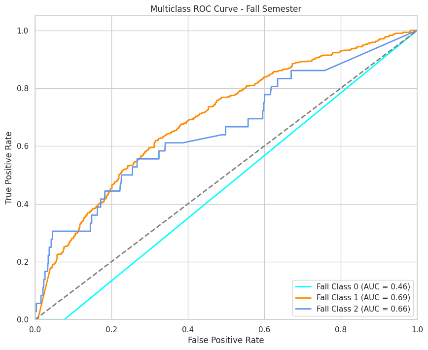
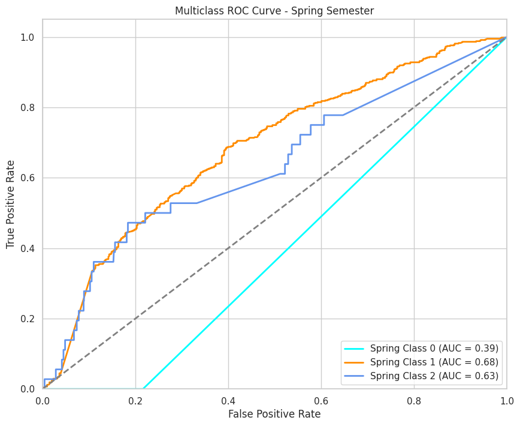
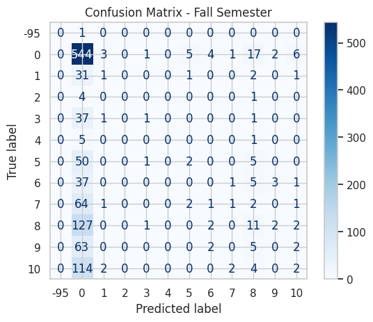
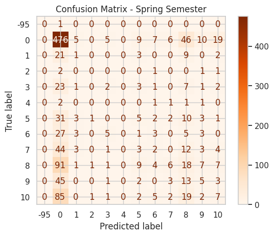
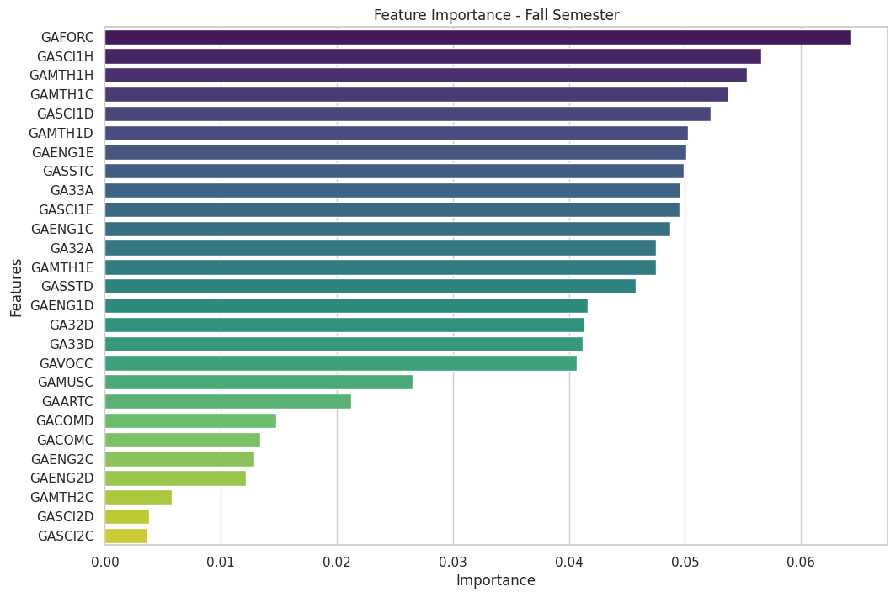
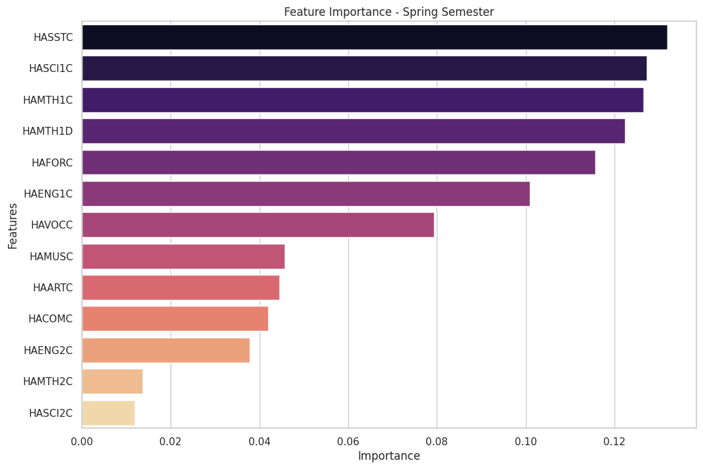

# 10th Grade Educational Survey Data Analysis

## Repository Structure

```bash
ISSR_Gender_Roles_Rashi_Gupta/
│
├── Analysis for 10th_grade/
│   ├── Readme.md              # Key components and process description
|   |── Detailed Report for Grade 10th _ Predicting College Major Choices.pdf           # contains the documentation 
|   |
│   ├── images/                # Visual representations (ROC Curves, etc.)
│   │   ├── roc_curve_fall.png
│   │   ├── roc_curve_spring.png
│   │   ├── confusion_fall.png
│   │   ├── confusion_spring.png
│   │   └── architecture_diagram.png
|   |
│   └── 10th-grade2.ipynb/
│       ├── data_preprocessing      # SMOTE, resampling, and other preprocessing techniques
│       ├── model_training         # RandomForestClassifier and GridSearchCV
│       ├── evaluation_metrics     # Precision, Recall, F1-Score, Accuracy, and ROC Curves
│       └── cross_validation       # Cross-validation and data splitting

```

## Key Components

### 1. Data Preprocessing

- **SMOTE (Synthetic Minority Over-sampling Technique)**: Used to balance the dataset by generating synthetic samples for minority classes to improve model performance.
- **Cross-Validation**: Applied to assess the model's performance and ensure it generalizes well to unseen data.
- **Grid Search**: Used to find the optimal hyperparameters for the RandomForestClassifier.

### 2. Model Training and Evaluation

- **Models Trained**: RandomForestClassifier
- **Performance Metrics**: Precision, Recall, F1-Score, Accuracy, ROC Curves
- **Data Splits**: Training and Testing sets, with resampling techniques to handle imbalanced classes.

### 3. Visual Representations

#### ROC Curves

The ROC curves illustrate the performance of the model across different classes. The area under the curve (AUC) indicates the model's ability to distinguish between classes.




#### Confusion Matrices

Confusion matrices provide insights into the number of true positive, true negative, false positive, and false negative predictions.




#### Feature Importance





## Architecture Diagrams

### Overall Architecture

This diagram outlines the overall workflow of the project, from data collection to model evaluation.


### Model Architecture

This diagram details the model architecture, including feature selection, model training, and evaluation processes.


