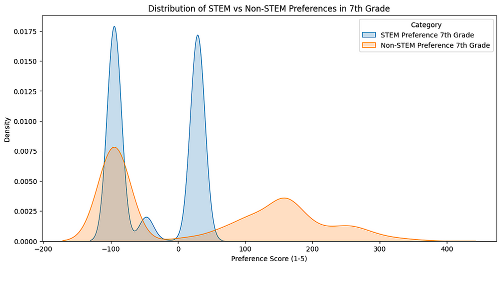
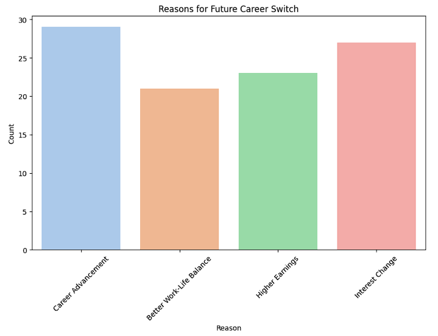
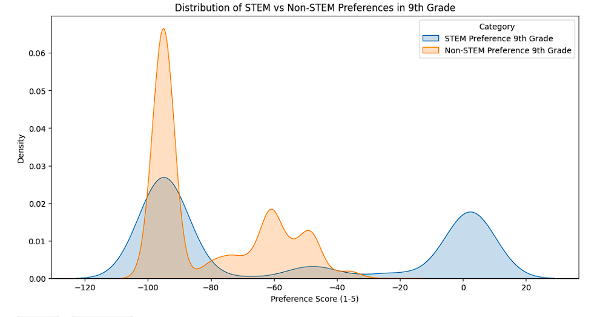

# Gender, Roles & Careers: Exploring Congruity Theories

Understanding how gender roles and perceptions influence career choices and academic paths is crucial for fostering an environment where all students can thrive. By analyzing data from [The Longitudinal Study of American Youth (1987–1994, 2007–2011, 2014–2017)](https://www.icpsr.umich.edu/web/ICPSR/studies/30263), covering 7th, 8th, and 9th grades, we can explore how these early experiences shape students' future aspirations, providing insights into gender congruity theories. This README summarizes key findings from comprehensive analyses across these formative years.

## Project Overview

My code and all results can be found on [GitHub](https://github.com/your-repo-link).
The blog for this can also be found on [Medium]().

### 7th Grade: Setting the Stage for Gender Perceptions

#### Key Insights:
- **Subject Preferences and Teacher Influence:** Students' enjoyment of subjects like Math, Science, and English, and their perceptions of teacher clarity, show early signs of gendered preferences. Boys tend to lean more towards Math and Science, while girls show a balanced interest across subjects.
- **Parental Expectations and Gender Roles:** Parental expectations and rewards for academic performance vary, often reflecting traditional gender roles. This early reinforcement plays a significant role in shaping students' academic motivations and future goals.

The plot compares how much 7th-grade students like STEM subjects (like math and science) versus Non-STEM subjects (like English and art). It shows that the preferences are spread out and highlights which subjects students generally prefer more.

#### Recommendations:
- **For Educators:** Encourage gender-neutral support in all subjects, emphasizing clarity and enjoyment to foster equal interest in Math and Science among boys and girls.
- **For Parents:** Promote and reward academic achievements uniformly across subjects, regardless of gender, to prevent the reinforcement of traditional gender roles.

### 8th Grade: Shaping Gendered Career Aspirations

#### Key Insights:
- **Career Aspirations and Gender Stereotypes:** Students' first-choice careers in 8th grade often reflect traditional gender roles, with boys leaning towards STEM fields and girls towards humanities and social sciences. These choices are strongly correlated with their future college majors.
- **Grades, Enjoyment, and Gender:** High grades and enjoyment in Math and Science increase the likelihood of boys choosing STEM majors. For girls, enjoyment in these subjects is equally important but often overshadowed by societal expectations.
- **Influence of Gender Perceptions:** Beliefs about gender proficiency in Math and Science show less influence on major choices compared to actual enjoyment and performance in these subjects.

#### Recommendations:
- **For Educators:** Actively counteract gender stereotypes in career counseling, highlighting successful role models from both genders in all fields.
- **For Parents:** Encourage exploration of a wide range of careers, breaking down traditional gender roles and supporting interests in all fields, particularly STEM for girls.

### 9th Grade: Cementing Gendered Interests

#### Key Insights:
- **Subject Preferences and Gender Dynamics:** By 9th grade, students' preferences and perceived teacher clarity in Math, Science, and English reflect entrenched gender roles, with boys showing higher interest in STEM and girls in humanities.
- **Career Utility and Parental Influence:** The perceived career utility of subjects and parental expectations continue to play significant roles, often reinforcing traditional gender roles.
- **Predictive Models and Gender:** Predictive models, such as Random Forest, indicate that gender plays a role in determining college major choices and overall satisfaction, with boys gravitating towards STEM and girls towards humanities and social sciences.

The plot compares how much 9th-grade students like STEM subjects (like math and science) versus Non-STEM subjects (like English and art). It shows that the preferences are spread out and highlights which subjects students generally prefer more.

#### Recommendations:
- **For Educators:** Provide targeted support to break down gender barriers in STEM, ensuring that both boys and girls receive encouragement and resources to pursue their interests.
- **For Parents:** Foster an environment where gender does not dictate career choices, emphasizing the value of all fields and supporting children in pursuing their genuine interests.

## Conclusion: Challenging Gender Congruity Theories

The journey from 7th to 9th grade is a critical period for shaping students' perceptions of gender roles and career aspirations. By understanding and addressing these influences, educators and parents can help dismantle traditional gender stereotypes and support all students in achieving their full potential. Early intervention and continuous support can significantly impact students' long-term satisfaction and success, paving the way for a more equitable and diverse future workforce.

## Acknowledgement

This project is supported by the Google Summer of Code program and HumanAI. Firstly, I want to thank my mentors, Joan Barth and Erika Steele, who guided me through the whole project. Secondly, I want to thank Dr. Sergie Gleyzer and Andrea Underhill, who provided super helpful suggestions for the project review.