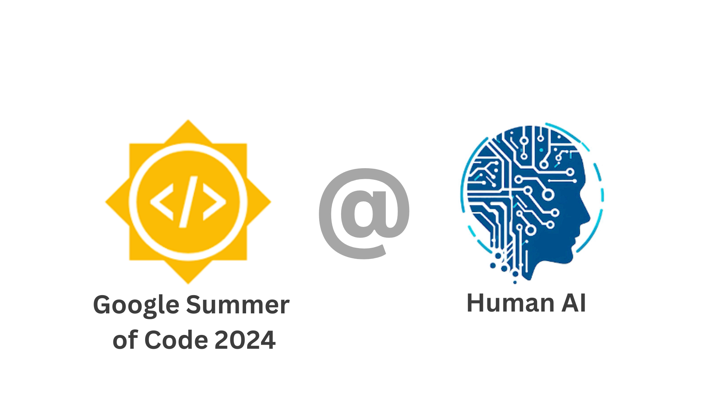

# ISSR


## Getting Started

### Prerequisites
- **Python Version**: 3.10 or 3.11 (recommended)
  - Python 3.12 is supported but may require additional setup on Windows
- **Operating System**: Windows, macOS, or Linux
- **Git**: For cloning the repository
- **Jupyter Notebook**: For running project notebooks

### Installation

1. **Clone the repository**
```bash
git clone https://github.com/humanai-foundation/ISSR.git
cd ISSR
```

2. **Set up Python environment**

**Using Conda (Recommended):**
```bash
conda create -n issr python=3.11
conda activate issr
```

**Using venv:**
```bash
python -m venv issr_env
# Windows:
issr_env\Scripts\activate
# macOS/Linux:
source issr_env/bin/activate
```

3. **Install dependencies**
```bash
pip install -r requirements.txt
```

4. **Navigate to a project and run**
```bash
cd ISSR_Gender_Roles_Career_Rashi_Gupta
jupyter notebook
```

### Windows-Specific Notes

⚠️ **If using Python 3.12 on Windows** and encountering `pandas` installation errors:

**Quick Fix (Recommended):** Use Python 3.11
```bash
conda create -n issr python=3.11
conda activate issr
pip install -r requirements.txt
```

**Alternative Solutions:**
- Install [Visual Studio Build Tools](https://visualstudio.microsoft.com/downloads/) with C++ workload
- Upgrade pandas: `pip install pandas>=2.2.0`

For detailed troubleshooting, see [TROUBLESHOOTING.md](TROUBLESHOOTING.md)

---

## 1. Background

The Mission of the Institute for Social Science Research (ISSR) at the University of Alabama is to promote and support high-quality social science research across various disciplines. The ISSR aims to foster interdisciplinary collaboration, to provide resources and support for social science research, and to contribute to the advancement of knowledge and understanding of social phenomena.

## 2. Projects

| Project Name | Contributor | Task | ML Techniques | Repository Link | Blog Post |
|---|---|---|---|---|---|
|[Examination of the evolution of language among Dark Web users](https://summerofcode.withgoogle.com/programs/2024/projects/kN6CmoUo)|Domenico Lacavalla |Examining changes in criminal language on the dark web over time. |Clustering Techniques-BERT Models-LSTM-LightGBM|[Click Here](https://github.com/humanai-foundation/ISSR/tree/main/ISSR_Dark_Web_Domenico_Lacavalla)|[Click Here](https://medium.com/@domenicolacavalla8/examination-of-the-evolution-of-language-among-dark-web-users-67fd3397e0fb)|
|[Gender, Roles & Careers: Exploring Congruity Theories](https://summerofcode.withgoogle.com/programs/2024/projects/lz5XGsgO)|Rashi Gupta |Analyzing gender's impact on career choices. |Predictive Techniques-Random Forest Model|[Click Here](https://github.com/humanai-foundation/ISSR/tree/main/ISSR_Gender_Roles_Career_Rashi_Gupta)|[Click Here](https://rashiguptaofficial.medium.com/exploring-gender-roles-in-education-a-grade-wise-analysis-cb87db14bc7d#3e03)|
|[Improve Accuracy for Mixed Data Prediction](https://summerofcode.withgoogle.com/programs/2024/projects/mco38xiq)|Shao Jin| Predict and evaluate Alabama youth tobacco usage data. Design and analyze qualitative question answer. |KNN Classifier, Random Forest Classifier, XGBRegressor, RandomForestRegressor|[Click Here](https://github.com/humanai-foundation/ISSR/tree/main/ISSR_Improve_Accuracy_Mixed_Data_Shao_Jin)|[Click Here](https://medium.com/@sj3192/enhancing-program-evaluation-research-by-leveraging-ai-for-integrated-analysis-of-mixed-methods-18c818d77527)|
|[Fatigue and Distraction Detection for Drivers](https://summerofcode.withgoogle.com/programs/2024/projects/lqT70TLt)|Aditya Arvind|Detect fatigue and driving distractions like phone usage during driving. |Yolov10, Mediapipe, TensorRT, CLIP|[Click Here](https://github.com/humanai-foundation/ISSR/tree/main/ISSR_Fatigue_detection)|[Click Here](https://medium.com/@aditya.arvind97/fatigue-detection-and-driver-distraction-monitoring-b895a5ee287c)|

## 3. Contributing

We welcome contributions! To contribute:

1. Fork the repository
2. Create a feature branch (`git checkout -b feature/amazing-feature`)
3. Commit your changes (`git commit -m 'Add amazing feature'`)
4. Push to the branch (`git push origin feature/amazing-feature`)
5. Open a Pull Request

## 4. Support

For issues and questions:
- Check [TROUBLESHOOTING.md](TROUBLESHOOTING.md) for common problems
- Search [existing issues](https://github.com/humanai-foundation/ISSR/issues)
- Create a [new issue](https://github.com/humanai-foundation/ISSR/issues/new) if needed

## 5. License

This project is part of Google Summer of Code 2024 under HumanAI Foundation.

## 6. Acknowledgments

- **Institute for Social Science Research (ISSR)**, University of Alabama
- **HumanAI Foundation**
- **Google Summer of Code 2024**
- All contributors and mentors